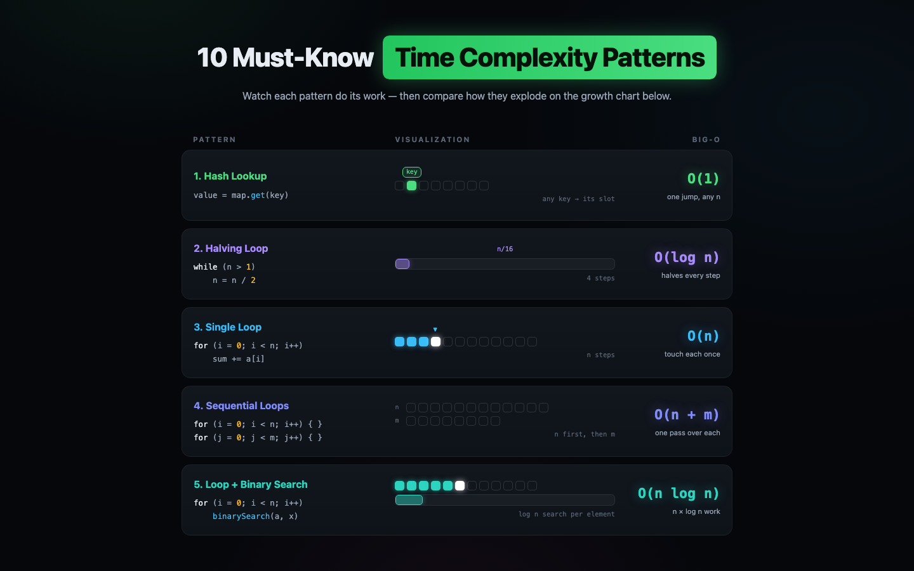

# Big-O Visualizer

[](https://github.com/art-ps/big-o/actions/workflows/pages.yml)

Animated, dark-neon single-page site that makes time complexity visible — watch
each pattern do its work, then compare how they explode on the growth chart.

**[Live demo → art-ps.github.io/big-o](https://art-ps.github.io/big-o/)**

[](https://art-ps.github.io/big-o/)

## Features

- **10 Must-Know Time Complexity Patterns** — hash lookup, halving loop, single
  loop, sequential loops, loop + binary search, divide & conquer, nested loop,
  triangular loop, branching recursion, permutations. Each runs a looping
  visualization next to its code snippet and Big-O label.
- **Interactive growth chart** — O(1) through O(n!) side by side: toggleable
  curves, log/linear scale, crosshair tooltip, and a table view.
- **Zero dependencies** — plain HTML/CSS/JS, no build step, no frameworks.

## Quick start

Open `index.html` in a browser, or serve the folder:

```bash
python3 -m http.server
```

Then visit <http://localhost:8000>.

## Project structure

```
index.html   — page markup, all sections
css/         — styles (dark neon theme, animations)
js/viz.js    — the 10 pattern visualizations
js/chart.js  — interactive growth chart
```

## Deployment

Pushes to `master` deploy automatically to GitHub Pages via
[`.github/workflows/pages.yml`](.github/workflows/pages.yml).

## Related

Companion to [Sorting Visualizer](https://github.com/art-ps/sorting-viz), which
animates six sorting algorithms beside the Go code each one is running.

## License

[MIT](LICENSE)
